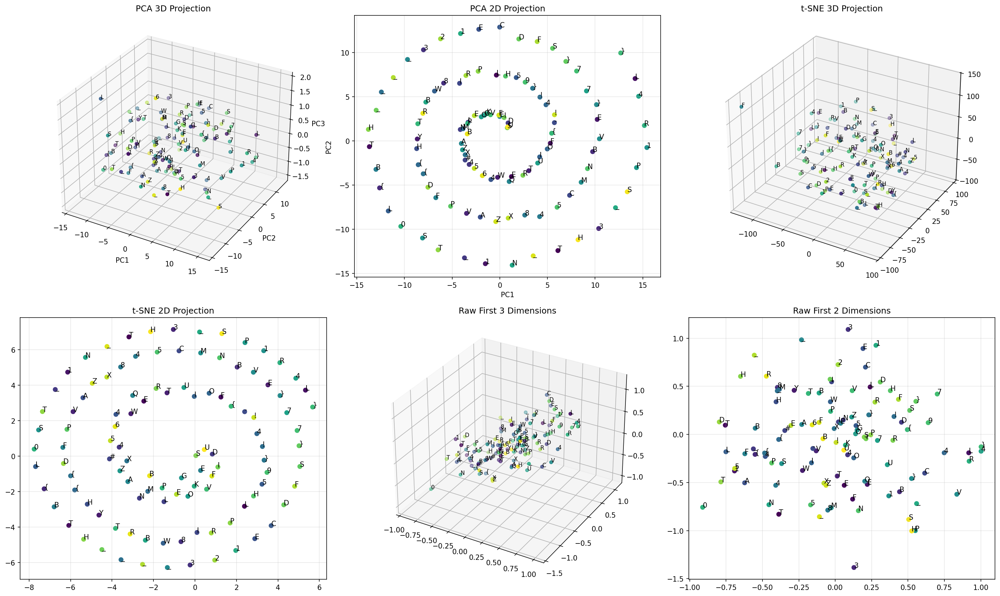

# Lost in Hyperspace - Challenge Writeup

## Challenge Description

*"A cube is the shadow of a tesseract casted on 3 dimensions. I wonder what other secrets may the shadows hold."*

**File provided:** `token_embeddings.npz`

This cryptic message hints at dimensionality reduction - just as a tesseract (4D hypercube) casts a 3D shadow, our high-dimensional data might reveal secrets when projected to lower dimensions.

## Initial Analysis

When I first opened the NPZ file, I found:
- **110 character tokens** (single characters including letters, numbers, and symbols)
- **512-dimensional embeddings** for each token (float64 vectors)

The tokens string looked scrambled:
```
TLETFL1EYWTV3{B834_DNL#IC-HAE4C5LWIO4{M!_{X}84BEFQA_}VM1SGZPOU74NB_1KR0PT{}V795NHPS}D_IRSHPTD2RF_EX5!ZF_6RBSHU
```

I could see familiar flag components scattered throughout: `HTB{`, `}`, underscores, and alphanumeric characters. The challenge was clear - these tokens were spatially encoded in 512-dimensional space, and I needed to find the correct order.

## Approach 1: Understanding the "Shadow" Metaphor

The challenge description was the key insight. A tesseract's shadow in 3D space reveals structure not immediately visible in 4D. Similarly, projecting from 512D to 2D/3D would reveal the hidden structure.

### PCA (Principal Component Analysis)

I applied PCA to reduce the 512-dimensional embeddings to 2D:

```python
from sklearn.decomposition import PCA
from sklearn.preprocessing import StandardScaler

# Standardize embeddings
scaler = StandardScaler()
embeddings_scaled = scaler.fit_transform(embeddings)

# Apply PCA
pca = PCA(n_components=2)
reduced = pca.fit_transform(embeddings_scaled)
```

**Result:** The first two principal components captured **82.75% of the variance** (44.6% + 38.1%), which meant the 2D projection retained most of the important structural information.

### Visualization

I plotted the tokens in 2D space, which revealed that the characters were indeed spatially distributed in a meaningful pattern:



## Approach 2: Failed Ordering Attempts

Before finding the solution, I tried several straightforward ordering methods:

### 1. **Simple Coordinate Sorting**
- Sorted by X coordinate (PC1)
- Sorted by Y coordinate (PC2)
- Sorted by distance from origin
- Sorted by angle from origin

**Why it failed:** These gave strings like:
```
HTB_{_L_0_HYT{SR{3BDWFT28PIN1AZM_#XRVBPL45EPEAO6G1KV4ZLWFCEIHSUDXQEN5DR89T}_FU4I!4OF{S-!5T}C7HM7NB}E3V_}SLP4R1
```

The flag components were present but completely scrambled. The spatial arrangement wasn't captured by simple 1D sorting.

### 2. **Grid-Based Reading Patterns**
I tried treating the 2D space as a grid and reading in various patterns:
- **Row-by-row** (left-to-right, top-to-bottom)
- **Snake/zigzag** (alternating row directions)
- **Column-by-column** (top-to-bottom, left-to-right)
- **Spiral** from center outward

**Why it failed:** These patterns assumed a regular grid structure. The PCA projection doesn't place points on a regular grid - they're scattered based on their high-dimensional relationships.

### 3. **Diagonal Traversals**
- Main diagonal (top-left to bottom-right)
- Anti-diagonal (top-right to bottom-left)

**Why it failed:** Again, assuming a specific geometric pattern that didn't match the actual spatial distribution.

## The Solution: Nearest-Neighbor Chain

### The Key Insight

The tokens weren't arranged in a grid or along simple geometric patterns. Instead, they formed a **path through space** where proximity in the 512-dimensional embedding space (and thus the 2D projection) determined the sequence.

Think of it like a treasure hunt where each clue leads you to the next closest location. The flag was encoded as a path, and I needed to traverse it.

### Implementation

```python
def nearest_neighbor_chain(reduced, tokens, start_idx=None):
    """
    Traverse the 2D space using nearest-neighbor algorithm.
    Starting from a point, always move to the closest unvisited neighbor.
    """
    n = len(tokens)
    visited = [False] * n
    result = []
    
    # Try starting from different 'H' characters (HTB{ flag format)
    possible_starts = [i for i, t in enumerate(tokens) if t == 'H']
    
    best_result = None
    
    for start in possible_starts:
        visited = [False] * n
        result = []
        current = start
        
        for _ in range(n):
            visited[current] = True
            result.append(tokens[current])
            
            # Find nearest unvisited neighbor
            min_dist = float('inf')
            nearest = -1
            
            for i in range(n):
                if not visited[i]:
                    dist = np.linalg.norm(reduced[current] - reduced[i])
                    if dist < min_dist:
                        min_dist = dist
                        nearest = i
            
            if nearest == -1:
                break
            current = nearest
        
        candidate = ''.join(result)
        
        # Check if this looks like a valid HTB{...} flag
        if candidate.startswith('HTB{') and '}' in candidate:
            end_idx = candidate.index('}', 4) + 1
            flag = candidate[:end_idx]
            if 15 <= len(flag) <= 50:
                best_result = flag
    
    return best_result
```

### Why This Works

1. **Spatial Relationships Matter:** The 512D embeddings encode relationships between tokens. When projected to 2D, nearby points in the high-dimensional space remain nearby.

2. **Path Encoding:** The flag was encoded as a sequential path through this space, not as a geometric pattern.

3. **Starting Point:** The algorithm tries starting from each 'H' character (since HTB flags start with "HTB{") and follows the nearest-neighbor chain.

4. **Greedy Traversal:** At each step, moving to the closest unvisited neighbor naturally follows the path encoded in the embedding space.

## The Flag

Starting from the correct 'H' (at index 89) and following the nearest-neighbor chain:

```
HTB{L0ST_1N_TH3_SP1R4L}
```

The remaining characters after the flag are just noise/padding in the dataset.

## Key Takeaways

### What Worked
- **PCA dimensionality reduction** was the right tool for "casting shadows" from 512D to 2D
- **Visualizing the projection** helped understand the spatial distribution
- **Nearest-neighbor traversal** correctly decoded the path-based encoding
- **Trying multiple starting points** ensured we found the valid flag

### What Didn't Work
- Simple coordinate-based sorting (1D orderings)
- Grid-based reading patterns (assumed regular structure)
- Geometric patterns (diagonal, spiral, etc.)

### Lessons Learned
1. **Challenge descriptions matter:** "Tesseract shadow" was a direct hint about PCA/dimensionality reduction
2. **Think spatially:** High-dimensional embeddings encode relationships that manifest as proximity in projections
3. **Path vs. Pattern:** Not all spatial encodings are grid-based; some are sequential paths through space
4. **Iterate approaches:** When simple orderings fail, consider graph-based traversal algorithms

## Running the Solution

```bash
python solve.py
```

The script will:
1. Load the NPZ file
2. Apply PCA to reduce to 2D
3. Create a visualization (`projection_2d.png`)
4. Find the flag using nearest-neighbor traversal
5. Print the flag: `HTB{L0ST_1N_TH3_SP1R4L}`

**Dependencies:**
- numpy
- matplotlib  
- scikit-learn

---

**Flag:** `HTB{L0ST_1N_TH3_SP1R4L}`
